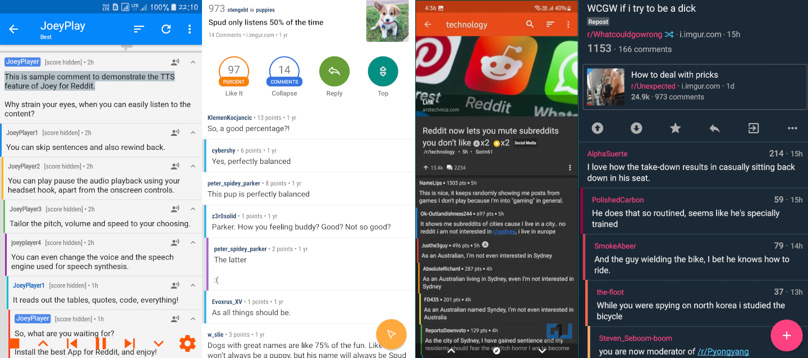
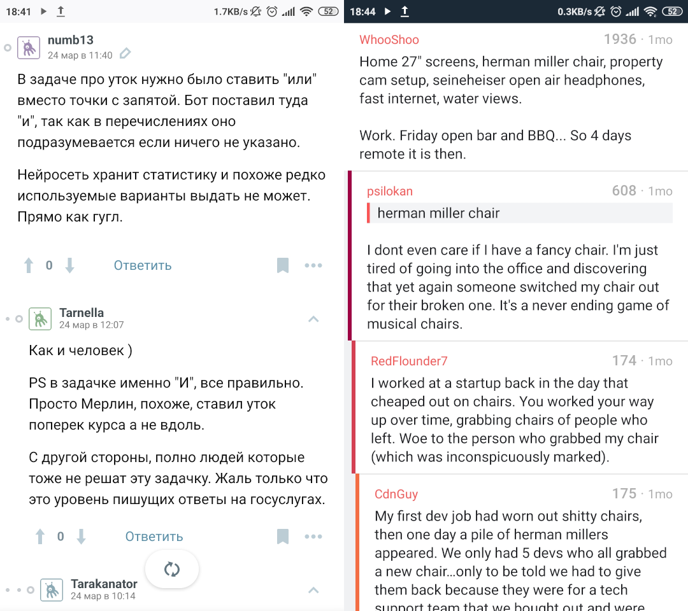
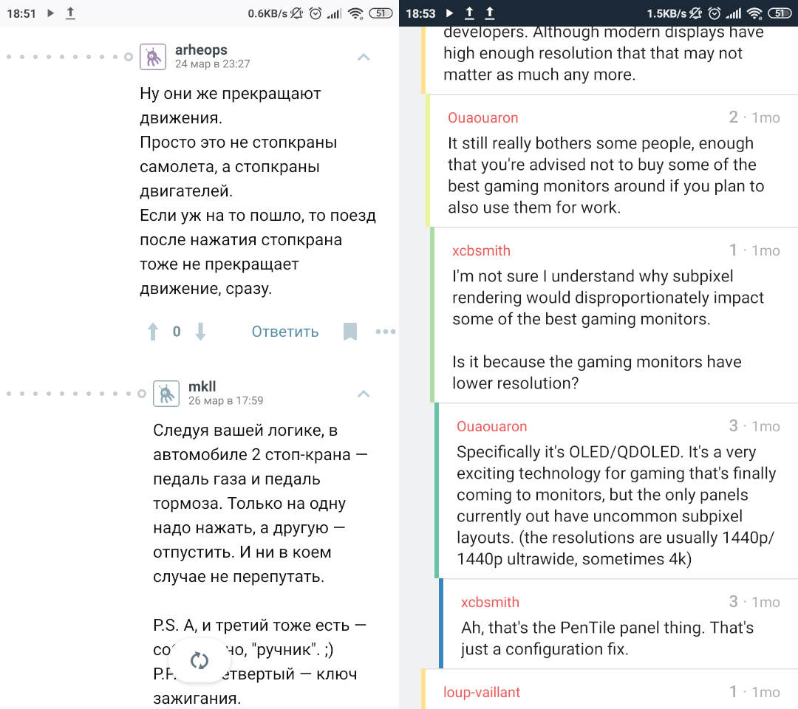
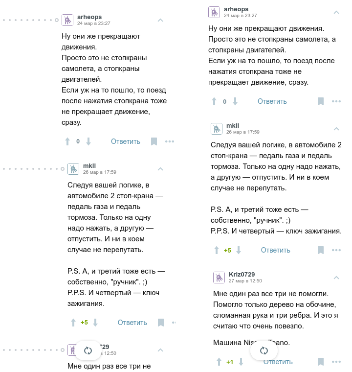
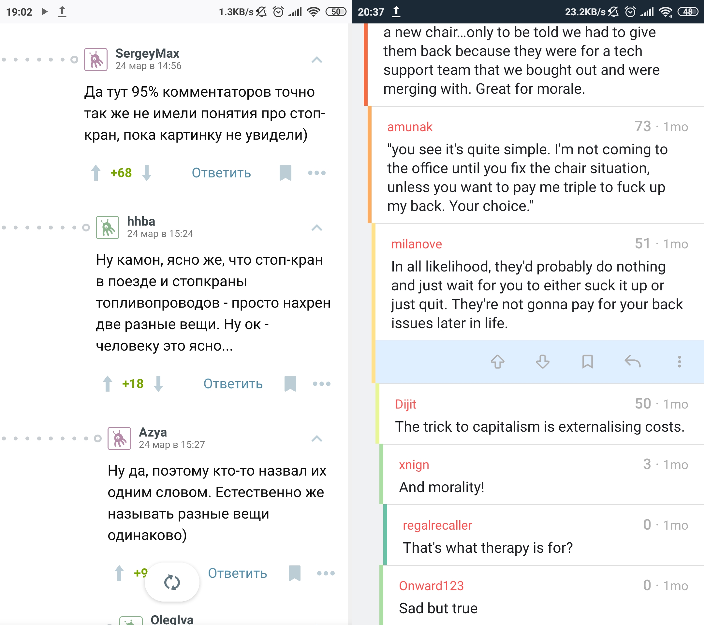
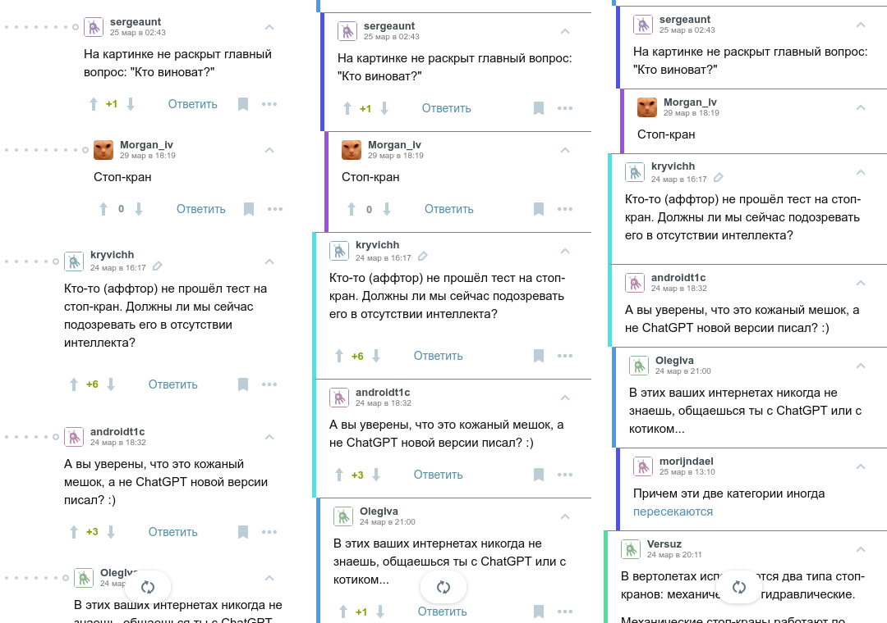

Я люблю древовидные комментарии. Для них сложно найти лучшую альтернативу. Интерфейсы форумов из двухтысячных выглядят слишком огромными для сообщений в два-три предложения. В линейном потоке сообщений мессенджера бывает сложно понять, кому кто отвечает. А имиджборды мне приходилось на полном серьезе учиться читать.

Одна из самых старых и самых популярных площадок с деревьями комментариев — это Reddit. Правда, большая часть его пользователей едина в одном: его интерфейс ужасен. Но его API открыто, поэтому на выбор есть множество клиентских приложений, особенно для мобильных телефонов — на КДПВ [Joey], [Relay], [Slide] и [Boost], а есть еще и другие. Их авторы — как правило, и сами недовольные стандартным интерфейсом Реддита — потратили много времени и сил на поиск удобного интерфейса для комментариев. И большая их часть пришла к очень похожим вариантам дизайна.

[joey]: https://play.google.com/store/apps/details?id=o.o.joey
[relay]: https://play.google.com/store/apps/details?id=reddit.news
[slide]: https://play.google.com/store/apps/details?id=me.ccrama.slideforreddittabletuiunlock
[boost]: https://play.google.com/store/apps/details?id=com.rubenmayayo.reddit



В этой статье я хочу разобрать, чем мне так нравится такой дизайн деревьев комментариев, сравнить его с деревьями комментариев Хабра, и попробовать пофантазировать, как бы могли выглядеть комменты Хабра в интерфейсе клиентов для Reddit.

## Основы

Какой паттерн интерфейса я называю в этой статье "деревом комментариев"?

- Для каждого комментария есть не более одного другого, с которым он связан как продолжение диалога.

  Будем называть такой комментарий родительским, а комментарий-ответ — дочерним. Строго говоря, это не всегда именно ответ. Например, это может быть продолжение предыдущего комментария того же автора.

- Дочерние комментарии расположены "ниже" в иерархии на странице, чем родительские.

  Как правило, это реализуется отступами слева, но почти всегда есть еще и другие маркеры. Из-за несоответствия этому признаку я не называю комменты в твиттере древовидными.

В пример приведу как раз те интерфейсы, которые хотел бы сегодня разобрать. Слева — комментарии на Хабре, справа — комментарии в одном из клиентов Реддита ([Boost]).



А теперь давайте разберем их по косточкам.

## Отступы

В первую очередь, можно обратить внимание на то, как по-разному отображается иерархия комментариев. На Хабре это довольно большие отступы слева, плюс точки по числу уровней вложенности (до определенного максимума):



Комментарии в Boost тоже используют отступы, но намного меньшие. Это позволяет им использовать намного больше пространства для, собственно, текста. У Boost примерно такой же потолок глубины отступов — правда, продолжение он предлагает читать на другой странице. Но даже при такой вложенности текст на экране все еще занимает намного большую часть места.

Как бы выглядел Хабр с такими отступами? На реальном телефоне поменять стили сложновато, поэтому я использовал DevTools в Firefox, чтобы проверить. Включил Responsive Design Mode с пресетом `Galaxy S10/S10+ Android 11` и набрал в консоли следующее:

```js
$$(".tm-comment-thread__comment > *")
  .forEach(el => el.style.cssText += "margin-left: 0;")
$$(".tm-comment-thread")
  .forEach(el => el.style.cssText += "position: unset; margin-left: 5px;")
$$(".tm-comment-thread__breadcrumbs")
  .forEach(el => el.style.cssText += "display: none;")
```



Сразу видно, что теперь на один экран влезают не два комментария, а уже три. И они не ютятся на правой половине экрана. Но намного хуже стала считываться вложенность. Как с этим борется Boost?

## Индикаторы вложенности

Посмотрим еще раз на комментарии в обоих приложениях. И там, и там есть дополнительные индикаторы вложенности: кружочки на Хабре, полосы в Boost. Но на Хабре, как мне кажется, они считываются гораздо хуже. Давайте сравним, и даже дадим Хабру фору — уберем влияние цвета:


Кружочки на Хабре расположены слишком далеко от кружочков соседних комментариев, и их слишком много, чтобы посчитать. В итоге, основную работу по обозначению глубины берут на себя отступы. Думаю, поэтому их и сделали настолько большими.

Boost же использует вертикальные полосы на всю высоту комментария. Из-за того, что верхние и нижние концы этих полос очень близко к соседним, намного легче сравнить их вложенность.

```js
$$(".tm-comment-thread__comment")
  .forEach(el => el.style.cssText += `border-left: solid 5px grey; margin-left: -10px;`)
$$(".tm-comment-thread__children")
  .forEach(el => el.style.cssText += "padding-top: 0;")
$$(".tm-comment-thread")
  .forEach(el => el.style.cssText += "margin-bottom: 0;")
$$(".tm-comment-thread__comment")
  .forEach(el => el.style.cssText += "padding-top: 10px; border-top: solid 1px grey;")
```

Посмотрим, что получилось. Слева — оригинал, в центре — до применения последнего блока кода, справа — после.


## Цвет как индикатор глубины вложенности

Еще одним важным индикатором вложенности в Boost является цвет полосы слева. Основной принцип прост — комментарии на близких, но различных уровнях вложенности должны иметь разные цвета, причем чем ближе вложенность, тем ближе цвет. Давайте накостылим это для мобильного Хабра:

```js
var depth = el => {
  let d
  for (d = 0; el; el = el.parentElement) {
    if (el.classList.contains("tm-comment-thread")) d++
  }
  return d
}

var color = el => `hsl(${30 * depth(el)} 70% 60%)`

$$(".tm-comment-thread__comment")
  .forEach(el => el.style.cssText += `border-left: solid 5px ${color(el)};`)
```


## Панель действий

В Boost панель с кнопками действий для комментариев по умолчанию скрыта и открывается по длинному нажатию на комментарий. Это позволяет использовать еще больше пространства под сам текст комментариев. На Хабре, видимо, по инерции с десктопного интерфейса, кнопки отображаются под каждым из комментов.



Важную метаинформацию, вроде даты и рейтинга, Boost отображает справа от имени пользователя, там много пространства для этого. Для нашей демонстрации я немножко считерю, и скрою футер совсем. Просто представьте в своем воображении числа справа от ника.

```js
$$(".tm-comment-footer").forEach(el => el.style.cssText += "display: none;")
```



## Результаты

Что у нас получилось? На один экран теперь влезает чуть ли не в два раза больше комментариев, при этом их глубина и вложенность считываются как минимум не хуже. Я не уверен, вписывается ли такой дизайн в стиль Хабра, но как минимум Реддит так читать очень удобно. Да и в целом, мне сложно придумать более удачный дизайн для дерева комментариев, чем тот, к которому — возможно, даже независимо! — пришли почти все приложения для Реддита.

<details>

<summary>Весь мой костыльный код из статьи</summary>

Проверялось в Responsive Design Mode из Firefox с пресетом `Galaxy S10/S10+ Android 11`.

```js
// Отступы
$$(".tm-comment-thread__comment > *")
  .forEach(el => el.style.cssText += "margin-left: 0;")
$$(".tm-comment-thread")
  .forEach(el => el.style.cssText += "position: unset; margin-left: 5px;")
$$(".tm-comment-thread__breadcrumbs")
  .forEach(el => el.style.cssText += "display: none;")

// Индикаторы вложенности
$$(".tm-comment-thread__comment")
  .forEach(el => el.style.cssText += `border-left: solid 5px grey; margin-left: -10px;`)
$$(".tm-comment-thread__children")
  .forEach(el => el.style.cssText += "padding-top: 0;")
$$(".tm-comment-thread")
  .forEach(el => el.style.cssText += "margin-bottom: 0;")
$$(".tm-comment-thread__comment")
  .forEach(el => el.style.cssText += "padding-top: 10px; border-top: solid 1px grey;")

// Цвет как индикатор глубины вложенности
var depth = el => {
  let d
  for (d = 0; el; el = el.parentElement) {
    if (el.classList.contains("tm-comment-thread")) d++
  }
  return d
}

var color = el => `hsl(${30 * depth(el)} 70% 60%)`

$$(".tm-comment-thread__comment")
  .forEach(el => el.style.cssText += `border-left: solid 5px ${color(el)};`)

// Панель действий
$$(".tm-comment-footer").forEach(el => el.style.cssText += "display: none;")

```

</details>
