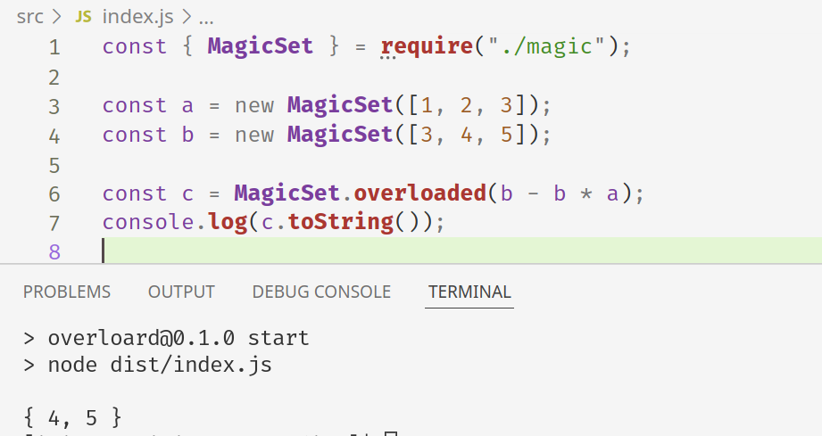

<figure class="border">



</figure>

Одна из активно реквестируемых фич [в JavaScript] и [в TypeScript] — перегрузка операторов. Без инфиксной записи, к примеру, получаются очень громоздкими вычисления с векторами или множествами. Тем не менее, используя <strike>сильное колдунство</strike> некоторые знания о том, как сейчас работают операторы в JavaScript, мы можем реализовать все самостоятельно.

[в javascript]: https://github.com/tc39/proposal-operator-overloading
[в typescript]: https://github.com/microsoft/TypeScript/issues?q=is%3Aissue+operator+overloading

<!-- more -->

Источник наиболее полной и поднобной информации о семантике операторов — это [текст стандарта ECMA-262]. Он формально описывает алгоритмы исполнения JavaScript похожим на псевдокод языком. Но он достаточно сложен для понимания неподготовленным читателем. Поэтому давайте пойдем другим путем — вспомним, к каким объектам JavaScript, не являющимся числами, часто применяют арифметические операторы.

[текст стандарта ecma-262]: https://tc39.es/ecma262/multipage/ecmascript-language-expressions.html#sec-evaluatestringornumericbinaryexpression

Первый из очевидных вариантов — строки. Оператор `+` для них означает конкатенацию:

```js
> 'foo' + 'bar'
'foobar'
```

К сожалению, никакие другие операторы для них не перегружены. Для нашего волшебного `MagicSet` этого маловато. Есть ли какие-то встроенные объекты, помимо чисел, к которым можно применить, например, вычитание? Если мы почитаем, например, [MDN], то можем наткнуться вот на такой пример кода:

[mdn]: https://developer.mozilla.org/en-US/docs/Web/JavaScript/Reference/Global_Objects/Date#calculating_elapsed_time

```js
// Using Date objects
let start = Date.now();

// The event to time goes here:
doSomethingForALongTime();
let end = Date.now();
let elapsed = end - start; // elapsed time in milliseconds
```

Как это работает при условии отсутствия в языке настоящих перегрузок операторов? Подсказку может дать результат выполнения похожего кода:

```js
> (new Date('2022-04-01 11:00') - new Date('2022-04-01 10:00'))
3600000
```

Как видим, результат вычитания — число, не объект `Date`. На самом деле, и вычитались тоже числа. При вычислении арифметических операторов с объектами JavaScript первым делом пытается превратить их в значения примитивного типа, используя их метод [`valueOf()`]. Для объектов Date он [переопределен], и возвращает количество миллисекунд с полуночи 1 января 1970 года.

[`valueof()`]: https://developer.mozilla.org/en-US/docs/Web/JavaScript/Reference/Global_Objects/Object/valueOf
[переопределен]: https://developer.mozilla.org/en-US/docs/Web/JavaScript/Reference/Global_Objects/Date/valueOf

Таким образом, мы можем преобразовать наши волшебные множества в числа, дать рантайму выполнить над ними операции по обычным правилам, а в методе `overload()` как-то преобразовать обратно. Но в этом "как-то" и кроется вся сложность. В отличие от, например, дат, множества трудно представить как числа так, чтобы семантика операций над ними была чем-то полезным. Остается, разве что, подобрать подходящий `MagicSet` перебором.

На самом деле, последний вариант не так страшен, как кажется — ведь у нас есть больше информации о вычисленном выражении, чем просто его результат! Для каждого из операндов вызвался метод `valueOf()` в том порядке, в котором эти операнды были вычислены. Мы можем сохранить эту последовательность, и использовать ее при нахождении решения.

Давайте сформулируем задачу чуть подробнее. Нам дан массив "идентификаторов" операндов — значений их `valueOf()` — в том порядке, в котором они были вызваны. Также известен результат выражения, также являющийся числом. Необходимо по этим данным восстановить вычисленное выражение — фактически, расставить символы операций между "идентификаторами", чтобы получить нужный ответ. Для того, чтобы не заморачиваться со скобками, будем пользоваться обратной польской нотацией и стековыми вычислениями.

Задачу можно решить поиском в ширину. Начнем с состояния, когда в стеке лежит первый операнд, положим это состояние в очередь. Затем для каждого элемента этой очереди посмотрим, какие состояния мы могли получить из него. Учитывая, что каждый операнд был использован заранее известное число раз, алгоритм не будет работать бесконечно.

```ts
type Operator = "+" | "-" | "*";

function reconstructReversePolishExpression(
  operandSequence: number[],
  result: number
): Array<number | Operator> {
  type State = {
    operandCount: number;
    stack: number[];
    expression: Array<number | Operator>;
  };

  const queue: State[] = [];

  if (operandSequence.length === 0) throw new Error();
  queue.push({
    operandCount: 1,
    stack: [operandSequence[0]],
    expression: [operandSequence[0]],
  });

  let state: State | undefined;
  while ((state = queue.shift())) {
    if (state.stack.length === 1 && state.stack[0] === result) {
      return state.expression;
    }

    if (state.stack.length >= 2) {
      const rest = [...state.stack];
      const b = rest.pop()!;
      const a = rest.pop()!;

      queue.push({
        operandCount: state.operandCount,
        stack: [...rest, a + b],
        expression: [...state.expression, "+"],
      });

      queue.push({
        operandCount: state.operandCount,
        stack: [...rest, a - b],
        expression: [...state.expression, "-"],
      });

      queue.push({
        operandCount: state.operandCount,
        stack: [...rest, a * b],
        expression: [...state.expression, "*"],
      });
    }

    if (state.operandCount < operandSequence.length) {
      queue.push({
        operandCount: state.operandCount + 1,
        stack: [...state.stack, operandSequence[state.operandCount]],
        expression: [...state.expression, operandSequence[state.operandCount]],
      });
    }
  }

  throw new Error();
}
```

Далее нужно вычислить полученное выражение, используя настоящие операндов. Для этого будем хранить для каждого соответствие "идентификаторов" и самих объектов `MagicSet`.

```ts
interface Operators<T> {
  add(a: T, b: T): T;
  sub(a: T, b: T): T;
  mul(a: T, b: T): T;
}

function computeReversePolishExpression<T>(
  operators: Operators<T>,
  expression: Array<number | Operator>,
  operandMap: Map<number, T>
): T {
  const stack: T[] = [];

  for (const atom of expression) {
    if (typeof atom === "number") {
      const operand = operandMap.get(atom);
      if (operand === undefined) throw new Error();

      stack.push(operand);
      continue;
    }

    if (stack.length < 2) throw new Error();

    const b = stack.pop()!;
    const a = stack.pop()!;

    switch (atom) {
      case "+":
        stack.push(operators.add(a, b));
        break;

      case "-":
        stack.push(operators.sub(a, b));
        break;

      case "*":
        stack.push(operators.mul(a, b));
        break;
    }
  }

  if (stack.length !== 1) throw new Error();
  return stack[0];
}
```

Дело осталось за малым — реализовать сам `MagicSet` и операции над ним.

```ts
export class MagicSet<T> {
  readonly items: ReadonlySet<T>;
  readonly _id: number;

  static _operandMap = new Map<number, MagicSet<any>>();
  static _usedOperands: number[] = [];

  constructor(items: Iterable<T>) {
    this.items = new Set(items);
    this._id = this.items.size === 0 ? 0 : Math.random();
    MagicSet._operandMap.set(this._id, this);
  }

  toString(): string {
    return "{ " + [...this.items].join(", ") + " }";
  }

  valueOf(): number {
    MagicSet._usedOperands.push(this._id);
    return this._id;
  }

  static add<T>(a: MagicSet<T>, b: MagicSet<T>): MagicSet<T> {
    return new MagicSet([...a.items, ...b.items]);
  }

  static sub<T>(a: MagicSet<T>, b: MagicSet<T>): MagicSet<T> {
    const items = new Set(a.items);
    for (const item of b.items) items.delete(item);
    return new MagicSet(items);
  }

  static mul<T>(a: MagicSet<T>, b: MagicSet<T>): MagicSet<T> {
    const items = new Set<T>();
    for (const item of a.items) {
      if (b.items.has(item)) items.add(item);
    }
    return new MagicSet(items);
  }

  static overloaded<T>(value: number): MagicSet<T> {
    const usedOperands = this._usedOperands;
    this._usedOperands = [];

    const expression = reconstructReversePolishExpression(usedOperands, value);
    const result = computeReversePolishExpression(MagicSet, expression, this._operandMap);

    return result;
  }
}
```

Вот и готов наш первоапрельский розыгрыш - настоящая\* перегрузка операторов в JavaScript!

[Код на GitHub].

[код на github]: https://github.com/iliazeus/overloard

<small>\*черную магию вне Хогвартса использовать в продакшене запрещено</small>
