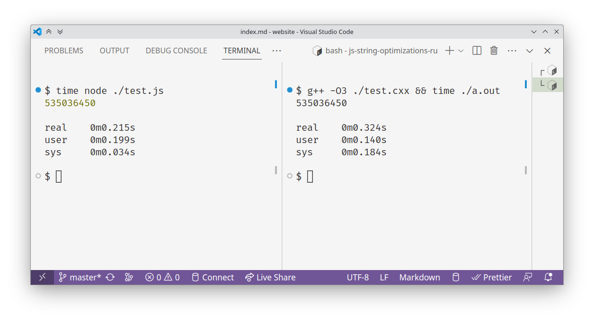

JavaScript was always, in one way or another, a text manipulation language - from early web page HTML to modern compilers and tooling. Not a surprise, then, that quite a lot of time was spent tuning and optimizing the string value handling in most modern JS engines.

In this article, I will focus on V8's implementation of strings. I will demonstrate various string optimizations by beating C++ in a _totally 100% legit_ benchmark. Finally, I will demonstrate the ways in which these implementation details might actually perform worse, and how to deal with that.



## Prerequisites

To be able to tell which string implementation V8 is using in any given moment, I will use V8's [debug intrinsics]. To be able to access those, run Node.js with an `--allow-natives-syntax` argument.

[debug intrinsics]: https://github.com/v8/v8/blob/941b945b/src/runtime/runtime.h#L20

```js
$ node --allow-natives-syntax
Welcome to Node.js v20.3.0.
Type ".help" for more information.
> %DebugPrint(123)
DebugPrint: Smi: 0x7b (123)

123
```

The `%DebugPrint()` intrinsic writes out quite a lot of info when used on strings. I will only show here the most important bits, using `/* ... */` to skip over the others.

## V8's string implementations

Inside V8's source code, there's a [handy list] of all the string implementations it uses:

[handy list]: https://github.com/v8/v8/blob/941b945b/src/objects/objects.h#L134-L151

- `String`
  - `SeqString`
    - `SeqOneByteString`
    - `SeqTwoByteString`
  - `SlicedString`
  - `ConsString`
  - `ThinString`
  - `ExternalString`
    - `ExternalOneByteString`
    - `ExternalTwoByteString`
  - `InternalizedString`
    - `SeqInternalizedString`
      - `SeqOneByteInternalizedString`
      - `SeqTwoByteInternalizedString`
    - `ConsInternalizedString`
    - `ExternalInternalizedString`
      - `ExternalOneByteInternalizedString`
      - `ExternalTwoByteInternalizedString`

Most of those, however, are combinations of several base traits:

### `OneByte` vs `TwoByte`

The ECMAScript standard [defines a string] as a sequence of 16-bit elements. But in a lot of cases, storing 2 bytes per character is a waste of memory. In fact, quite a lot of strings in most code will be limited to ASCII. That is why V8 has both one-byte and two-byte strings.

[defines a string]: https://262.ecma-international.org/14.0/#sec-ecmascript-language-types-string-type

Here is an example of an ASCII string. Notice its `type`:

```js
> %DebugPrint("hello")
DebugPrint: 0x209affbb9309: [String] in OldSpace: #hello
0x30f098a80299: [Map] in ReadOnlySpace
 - type: ONE_BYTE_INTERNALIZED_STRING_TYPE
 /* ... */
```

And here is a non-ASCII one. It has a two-byte representation:

```js
> %DebugPrint("привет")
DebugPrint: 0x1b10a9ba2291: [String] in OldSpace: u#\u043f\u0440\u0438\u0432\u0435\u0442
0x30f098a81e29: [Map] in ReadOnlySpace
 - type: INTERNALIZED_STRING_TYPE
 /* ... */
```

### `Internalized`

Some strings - string literals in particular - are _internalized_ by the engine - that is, collected into a single string pool. Whenever you use a particular string literal, the internalized version from this pool is used, instead of allocating a new one every time. Such strings will have an `Internalized` type:

```js
> %DebugPrint("hello")
DebugPrint: 0x209affbb9309: [String] in OldSpace: #hello
0x30f098a80299: [Map] in ReadOnlySpace
 - type: ONE_BYTE_INTERNALIZED_STRING_TYPE
 /* ... */
```

If a string value is only known at run time, it (usually) won't be internalized. Notice the absence of `INTERNALIZED` in its `type`:

```js
> var fs = require("fs")

> fs.writeFileSync("hello.txt", "hello", "utf8")

> var s = fs.readFileSync("hello.txt", "utf8")

> %DebugPrint(s)
DebugPrint: 0x2c6f46782469: [String]: "hello"
0xd2880ec0879: [Map] in ReadOnlySpace
 - type: ONE_BYTE_STRING_TYPE
 /* ... */
```

It is worth noting that this string can still be internalized. You can force that by turning it into a string literal with `eval`:

```js
> var ss = eval('"' + s + '"')
undefined
> %DebugPrint(ss)
DebugPrint: 0x80160fa1809: [String] in OldSpace: #hello
0xd2880ec0299: [Map] in ReadOnlySpace
 - type: ONE_BYTE_INTERNALIZED_STRING_TYPE
 /* ... */
```

### `External`

_External_ strings are the ones allocated outside JavaScript's heap. It is usually done for larger strings, to not move them around the memory at garbage collection. To demonstrate such a string, I will artificially limit V8's heap size, and then allocate a large string:


```js
// test.js

// a 16 megabyte string
var s = Buffer.alloc(16 * 2 ** 20, 65).toString("ascii");
console.log(s.length);
```

```bash
# and an 8 megabyte heap
$ node --max-old-space-size=8 test.js
16777216
```

### `Sliced`

Slicing a string in V8 does not actually copy the data most of the time. Instead, a _sliced_ string is created, storing a reference to a parent string, an offset and a length. Other languages would call that a _string view_ or a _string slice_.

```js
> var s = Buffer.alloc(256, 65).toString('ascii')
undefined
> %DebugPrint(s.slice(0, 15))
DebugPrint: 0x80e9bea9851: [String]: "AAAAAAAAAAAAAAA"
0xd2880ec1d09: [Map] in ReadOnlySpace
 - type: SLICED_ONE_BYTE_STRING_TYPE
 /* ... */
```

If, however, the substring is short enough, it's sometimes faster to just copy that tiny bit of data:

```js
> %DebugPrint(s.slice(0, 5))
DebugPrint: 0x18a9c2e10169: [String]: "AAAAA"
0xd2880ec0879: [Map] in ReadOnlySpace
 - type: ONE_BYTE_STRING_TYPE
 /* ... */
```

### `Cons`

String concatenation is optimized in a similar way. It yields a `Cons` string, which stores references to its left and right parts:

```js
> %DebugPrint(s + s)
DebugPrint: 0x2c6f467b3e09: [String]: c"AAAAAAAAAA/* ... */AA"
0xd2880ec1be9: [Map] in ReadOnlySpace
 - type: CONS_ONE_BYTE_STRING_TYPE
```

Again, shorter strings are usually just copied outright:

```js
> %DebugPrint(s.slice(0, 2) + s.slice(0, 3))
DebugPrint: 0xec9b3412501: [String]: "AAAAA"
0xd2880ec0879: [Map] in ReadOnlySpace
 - type: ONE_BYTE_STRING_TYPE
 /* ... */
```

## Beating C++ with string optimizations

Let's use all that we've learned so far to play a game of Unfair Benchmarks. The rules are simple: we have to think of a specific contrived task where JavaScript, because of its string optimizations, will be faster than the equivalent C++ code.

In our case, we'll exploit the fact that `Cons` and `Sliced` string don't copy the data.

```js
// unethical-benchmark.js
// given an ASCII string of length 1500,
// find the total length of those of its substrings
// that are longer than 200 chars

let text = "a".repeat(1500);
let result = "";

for (let i = 0; i < text.length; i++) {
  for (let j = i + 201; j < text.length; j++) {
    result += text.substr(i, j - i);
  }
}

console.log(result.length);
```

We'll run it on bare V8 using [jsvu]:

[jsvu]: https://www.npmjs.com/package/jsvu

```bash
$ time ~/.jsvu/bin/v8 unethical-benchmark.js
535036450

real    0m0.145s
user    0m0.122s
sys     0m0.028s
```

And here is the C++ code, translated line-by-line:

```c++
// unethical-benchmark.cxx
// given an ASCII string of length 1500,
// find the total length of those of its substrings
// that are longer than 200 chars

#include <iostream>
#include <string>

int main() {
  std::string text(1500, 'a');
  std::string result;

  for (int i = 0; i < text.length(); i++) {
    for (int j = i + 201; j < text.length(); j++) {
      result += text.substr(i, j - i);
    }
  }

  std::cout << result.length() << std::endl;
}
```

```bash
$ g++ -O3 unethical-benchmark.cxx && time ./a.out
535036450

real    0m0.324s
user    0m0.176s
sys     0m0.147s
```

This segment is, of course, a joke - both the code and the problem are obviously bad. But it succeeds demonstrating that even the most naive code can be sped up considerably by the V8's string optimizations.

## Unintended side effects, or: how to scrub a string

The downside of such implicit optimizations is, of course, that you can't really control them. In many other languages, a programmer can choose to explicitly use a string view or a string builder where they really need them. But JS has the programmer either hoping the engine is smart enough, or using black magic to force it to do what they want.

To demonstrate one such case, I will first write a simple script that will fetch a couple of web pages, and then extract from them all the linked URLs:

```js
// urls-1.js

async function main() {
  let pageUrls = [
    "https://habr.com/ru/companies/ruvds/articles/346442/comments/",
    "https://habr.com/ru/articles/203048/comments/",
  ];

  let linkUrls = [];

  for (let pageUrl of pageUrls) {
    let html = await (await fetch(pageUrl)).text();

    for (let match of html.matchAll(/href="(.*?)"/g)) {
      let linkUrl = match[1];

      linkUrls.push(linkUrl);
    }
  }

  for (let linkUrl of linkUrls) {
    console.log(linkUrl);
  }
}

main();
```

Let's find out the smallest heap size it will run on:

```bash
$ node --max-old-space-size=10 urls-1.js > /dev/null # works

$ node --max-old-space-size=9 urls-1.js > /dev/null

<--- Last few GCs --->

[252407:0x55b40628dbb0]     2894 ms: Mark-Compact 10.8 (13.7) -> 8.5 (16.9) MB, 9.22 / 0.00 ms  (average mu = 0.989, current mu = 0.683) allocation failure; scavenge might not succeed
[252407:0x55b40628dbb0]     2906 ms: Mark-Compact (reduce) 9.7 (16.9) -> 9.1 (10.4) MB, 2.68 / 0.00 ms  (+ 0.9 ms in 12 steps since start of marking, biggest step 0.1 ms, walltime since start of marking 10 ms) (average mu = 0.984, current mu = 0.681) fina

<--- JS stacktrace --->

FATAL ERROR: Reached heap limit Allocation failed - JavaScript heap out of memory
```

Looks like 10 megabytes is enough, but 9 isn't.

Let's try to make memory consumption even lower. For example, how about forcing the engine to collect the `html` data when it's no longer needed?

```js
// urls-2.js

async function main() {
  let pageUrls = [
    "https://habr.com/ru/companies/ruvds/articles/346442/comments/",
    "https://habr.com/ru/articles/203048/comments/",
  ];

  let linkUrls = [];

  for (let pageUrl of pageUrls) {
    let html = await (await fetch(pageUrl)).text();

    for (let match of html.matchAll(/href="(.*?)"/g)) {
      let linkUrl = match[1];

      linkUrls.push(linkUrl);
    }

    html = null; // <---
  }

  for (let linkUrl of linkUrls) {
    console.log(linkUrl);
  }
}

main();
```

```bash
$ node --max-old-space-size=9 urls-2.js > /dev/null

<--- Last few GCs --->

[252792:0x5576c8da8bb0]     3078 ms: Mark-Compact 8.9 (12.3) -> 7.3 (12.3) MB, 6.65 / 0.02 ms  (average mu = 0.997, current mu = 0.994) allocation failure; scavenge might not succeed
[252792:0x5576c8da8bb0]     3101 ms: Mark-Compact 10.7 (13.4) -> 8.5 (17.4) MB, 6.27 / 0.00 ms  (average mu = 0.992, current mu = 0.725) allocation failure; scavenge might not succeed


<--- JS stacktrace --->

FATAL ERROR: Reached heap limit Allocation failed - JavaScript heap out of memory
```

Nothing's changed! And the reason is actually those very string optimizations we discussed earlier. All the `urls` are actually `Sliced` strings, and that means they all retain references to the whole of `html` data!

The solution is to [scrub those strings clean]!

[scrub those strings clean]: https://habr-com.translate.goog/ru/articles/449368/?_x_tr_sl=ru&_x_tr_tl=en

```js
// urls-3.js

async function main() {
  let pageUrls = [
    "https://habr.com/ru/companies/ruvds/articles/346442/comments/",
    "https://habr.com/ru/articles/203048/comments/",
  ];

  let linkUrls = [];

  for (let pageUrl of pageUrls) {
    let html = await (await fetch(pageUrl)).text();

    for (let match of html.matchAll(/href="(.*?)"/g)) {
      let linkUrl = match[1];
      linkUrl = JSON.parse(JSON.stringify(linkUrl)); // <---

      linkUrls.push(linkUrl);
    }

    html = null;
  }

  for (let linkUrl of linkUrls) {
    console.log(linkUrl);
  }
}

main();
```

Looks like black magic alright. But does it work?

```bash
$ node --max-old-space-size=9 urls-3.js > /dev/null
# it works!

$ node --max-old-space-size=8 urls-3.js > /dev/null

$ node --max-old-space-size=7 urls-3.js > /dev/null

<--- Last few GCs --->

[253130:0x5566636cdbb0]     1621 ms: Scavenge 6.0 (8.8) -> 4.8 (8.8) MB, 1.45 / 0.00 ms  (average mu = 1.000, current mu = 1.000) task;
[253130:0x5566636cdbb0]     1631 ms: Mark-Compact 4.9 (8.8) -> 4.4 (9.0) MB, 5.01 / 0.00 ms  (average mu = 0.997, current mu = 0.997) allocation failure; GC in old space requested
[253130:0x5566636cdbb0]     1642 ms: Mark-Compact 7.3 (11.8) -> 7.0 (11.8) MB, 1.94 / 0.00 ms  (average mu = 0.996, current mu = 0.827) allocation failure; GC in old space requested


<--- JS stacktrace --->

FATAL ERROR: Reached heap limit Allocation failed - JavaScript heap out of memory
```

As you can see, the code now works fine with a 9 megabyte heap, only OOMing at 7 megabytes. That's two megabytes of RAM reclaimed by forcing the engine to use a specific string implementation.

We can reclaim even more by forcing one-byte representation of all the strings. Even though those string aren't really ASCII, the magic of UTF-8 will ensure our code works like before:

```js
// urls-4.js

async function main() {
  let pageUrls = [
    "https://habr.com/ru/companies/ruvds/articles/346442/comments/",
    "https://habr.com/ru/articles/203048/comments/",
  ];

  let linkUrls = [];

  for (let pageUrl of pageUrls) {
    let html = await (await fetch(pageUrl)).arrayBuffer(); // <---
    html = Buffer.from(html).toString("ascii"); // <---

    // this regular expression will still work as intended
    // when applied to individual bytes of a UTF-8 string
    // instead of proper code points

    for (let match of html.matchAll(/href="(.*?)"/g)) {
      let linkUrl = match[1];

      // in case a URL did actually contain non-ASCII chars
      linkUrl = Buffer.from(linkUrl, "ascii").toString("utf-8");

      linkUrls.push(linkUrl);
    }

    html = null;
  }

  for (let linkUrl of linkUrls) {
    console.log(linkUrl);
  }
}

main();
```

With that, we have reclaimed another megabyte:

```bash
$ node --max-old-space-size=7 urls-4.js > /dev/null
# it works!

$ node --max-old-space-size=6 urls-4.js > /dev/null

<--- Last few GCs --->

[253789:0x563785444bb0]     1749 ms: Mark-Compact 4.9 (9.3) -> 4.4 (9.5) MB, 2.12 / 0.00 ms  (average mu = 0.996, current mu = 0.831) allocation failure; GC in old space requested
[253789:0x563785444bb0]     2530 ms: Mark-Compact 7.5 (10.1) -> 5.5 (10.3) MB, 5.66 / 0.01 ms  (average mu = 0.994, current mu = 0.993) allocation failure; scavenge might not succeed


<--- JS stacktrace --->

FATAL ERROR: Reached heap limit Allocation failed - JavaScript heap out of memory
```

## In conclusion

Most modern JavaScript engines, including V8, have quite a lot of thought put into optimizing various string operations. In my article, I have explored some of those optimizations. While they might be hard to explicitly make use of, it is still quite useful to remember they exist - if only to debug [weird and unexpected] performance problems.

[weird and unexpected]: https://github.com/mrdoob/three.js/issues/9679
