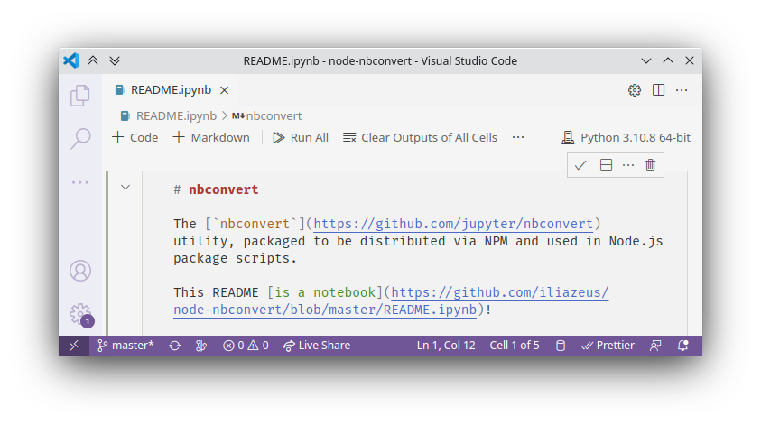
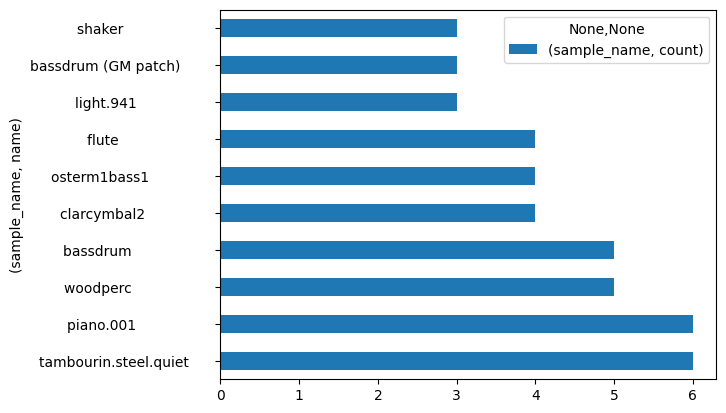
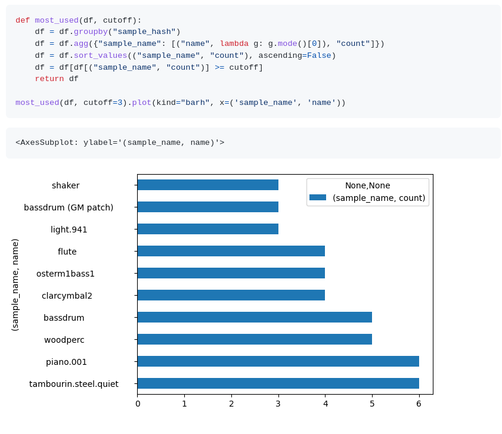
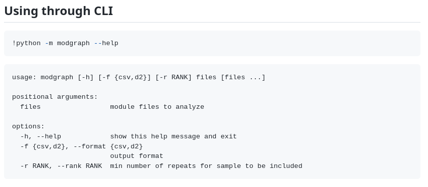

На одном из прошлых мест работы я поддерживал консольную Node.js-утилиту, которая публиковалась в NPM. Утилита использовала [`commander`], содержала довольно большое количество подкоманд, и все они требовали описания в README-файле, которое нужно было не забывать обновлять при каждом изменении. Несколько лет спустя я нашел решение, используя не слишком привычные для экосистемы Node.js технологии.

[`commander`]: https://www.npmjs.com/package/commander



В этой статье: много моей любви к [Jupyter]-подобным ноутбукам, инструкция про то, как затащить Python-пакет в NPM и чуть-чуть анализа трекерной музыки.

[jupyter]: https://jupyter.org/

<!-- more -->

### Давайте сначала про музыку

Одним из моих полузаконченных пет-проектов была небольшая Python-утилита [`modgraph`], которая позволяла посмотреть, насколько разные [трекерные] композиции пересекаются по используемым семплам. Ее можно было использовать и через CLI — она выдавала результаты в CSV для дальнейшего анализа в каком-нибудь Excel — так и как библиотеку, анализируя результаты, например, в pandas.

[`modgraph`]: https://github.com/iliazeus/modgraph
[трекерные]: https://ru.wikipedia.org/wiki/Трекерная_музыка

<figure class="border">

<figcaption>Самые популярные семплы в какой-то рандомной подборке модулей одного автора</figcaption>
</figure>

Пример такого использования я захотел описать в репозитории. Самым простым способом было дать ссылку на Jupyter-ноутбук, лежащий в репозитории — GitHub [умеет их отображать]. Но мне хотелось видеть эти примеры на первой странице репозитория и на странице пакета в PyPI, а для этого они должны были быть описаны в `README.md`.

[умеет их отображать]: https://github.com/iliazeus/modgraph/blob/master/README.ipynb

### `nbconvert`

[`nbconvert`] — это утилита, которая может отрендерить ноутбук в HTML, Markdown и другие форматы. Ее можно установить из того же [PyPI] (в моем случае — как dev-зависимость для [PDM]), и волшебное заклинание `nbconvert README.ipynb --to markdown` принесет мне ровно то, что я хотел. Ну, почти то, что хотел — некоторые вещи пришлось поправить руками, и встраивать base64-картинки в сам маркдаун `nbconvert` не умеет.

[`nbconvert`]: https://nbconvert.readthedocs.io/en/latest/
[pypi]: https://pypi.org/project/nbconvert/
[pdm]: https://pdm.fming.dev/latest/

Тем не менее, мои эстетические потребности это удовлетворило.

<figure class="border">

<figcaption>И код, и результаты — сразу в README</figcaption>
</figure>

Более того, я мог использовать команды шелла в этом же ноутбуке, чтобы описать то, как пользоваться CLI-утилитой. Теперь не было необходимости вручную править это описание при каждом изменении интерфейса — достаточно было перезапустить ноутбук, сохранить его, и перегенерировать README.

<figure class="border">

<figcaption>modgraph CLI</figcaption>
</figure>

И вот на этой мысли я увидел вьетнамские флешбеки из начала статьи.

### Как сделать так же, но для Node.js?

Как документировать таким же образом консольную Node.js-утилиту? На первый взгляд, отличий не должно быть: просто пишем `README.ipynb` с шелл-командами, затем запускаем `nbconvert` и получаем на выходе маркдаун. Однако есть один важный затык. Правильно организованные Node.js-проекты обычно предполагают, что после исполнения команды `npm install` проект готов к разработке. В частности, все необходимые утилиты — компиляторы, кодогенераторы, линтеры — были объявлены как `devDependencies` в `package.json` и установлены `npm install`.

Но `nbconvert` так не установить. Более того — не всегда получится дать достаточно вменяемую инструкцию для его установки. Делать `pip install nbconvert`? `conda install nbconvert`? `apt install nbconvert`? Нужен ли `venv`? Или `virtualenv`? Может быть не очень просто понять, как правильно пользоваться экосистемой пакетов Python, если привык к инструментам для Node.js — по крайней мере, у меня сходу не вышло.

<figure>

<figcaption>https://xkcd.com/1987/</figcaption>
</figure>

Поэтому я решил скрещивать ежа с ужом, а жабу с гадюкой. А именно:

### Опубликовать Python-утилиту в NPM

Инструкция из трех простых шагов.

#### 1. Упаковать пакет со всеми зависимостями в один файл

Утилита `pex` позволяет упаковать Python-пакет и все его зависимости в один файл, который потом можно запустить просто как `python foobar.pex`. Написав несложный скрипт, можно установить `pex` в локальный `venv` и собрать с его помощью `nbconvert.pex`.

#### 2. Собрать пакет-химеру

Таким именем я обозвал пакеты, которые содержат не JavaScript-библиотеку, а исполняемый файл или скрипт на другом языке. Эта идея не нова, общий паттерн такой: `post-install` скрипт скачивает бинарь, а отдельная обертка `run.js`, указанная в `package.json` как `"bin": "run.js"`, запускает его. Для такого паттерна даже есть несколько готовых библиотек вроде [binary-install].

[binary-install]: https://www.npmjs.com/package/binary-install

У нас ситуация чуть проще — утилита уже собрана, скачивать ее не надо. Но чуть сложнее — запустить ее просто как `nbconvert.pex` можно только на nix-системах — Windows не поймет shebang. Но базовый `run.js` несложно написать и самому. Разберем построчно:

```js
#!/usr/bin/env node

const { join } = require("path");
const { spawnSync } = require("child_process");

const result = spawnSync(
  // вызываем интерпретатор
  "python",
  [
    // передаем ему наш .pex, не забывая,
    // что рабочий каталог может быть другим
    join(__dirname, "nbconvert.pex"),
    // передаем далее все CLI-аргументы, кроме первых двух
    // первые два - это путь к бинарнику node и путь к run.js
    ...process.argv.slice(2),
  ],
  {
    // запускаем через шелл, чтобы он сам нашел python в PATH
    shell: true,
    // перенаправляем stdin, stdout, stderr
    stdio: "inherit",
  }
);

// после завершения процесса выходим сами с тем же кодом
process.exitCode = result.status;
```

#### 3. Опубликовать в NPM с разумным номером версии

Хотелось бы, чтобы у пакета была та же версия, что и у `nbcovert`, который он оборачивает. Но, с другой стороны, если меняются сами скрипты-обертки, разумно тоже увеличивать версию. Как компромисс, можно использовать версию `X.Y.Z`, где `X.Y` — это major и minor версии `nbconvert`, а `Z` — номер ревизии, который меняю я сам.

На первый взгляд, кажется более подходящей схема `X.Y.Z-R`, где `X.Y.Z` — полная версия nbconvert, а `R` — номер ревизии. Однако, в NPM принята semver, в которой `R` будет считаться пре-релизным тегом. Это приведет к тому, что версия `1.2.3-4` будет считаться более старой, чем версия `1.2.3`, и при команде `npm install nbconvert@^1.2.3` мы получим что-то более старое, чем хотели.

### Результаты

- PyPI-пакет `modgraph` ([PyPI]( https://pypi.org/project/modgraph/), [GitHub](https://github.com/iliazeus/modgraph)) с эстетически приятной README
- NPM-пакет `nbconvert` ([NPM](https://www.npmjs.com/package/nbconvert), [GitHub](https://github.com/iliazeus/node-nbconvert)) для эстетически приятных README в Node.js
- чуть лучше понимание <strike>эстетически неприятных</strike> систем пакетов в NPM и PyPI
- эстетически приятное удовольствие от ненормального программирования
