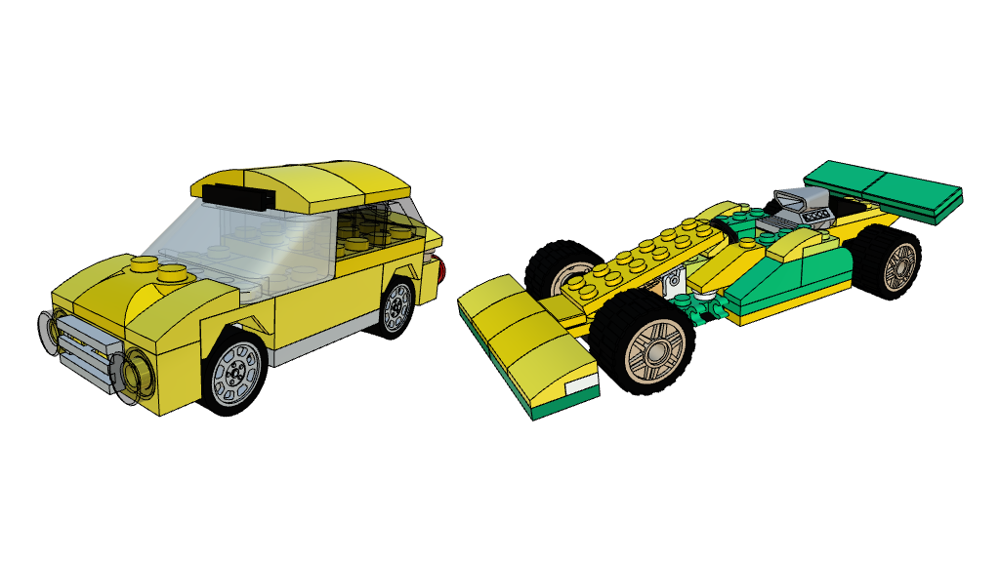
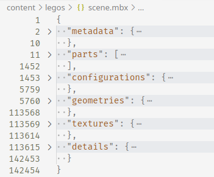

Несколько лет назад мне на день рождения подарили то, о чем я мечтал с детства — большую коробку с кучей деталей Лего, из которой можно было собрать что угодно. Мой внутренний ребенок очень быстро начал собирать из них машинки, а мой внутренний взрослый задумался — можно ли их как-то увековечить в цифровом виде, чтобы потом собрать снова, и чтобы показывать всем друзьям.

Я перепробовал несколько редакторов 3D-моделей Лего (моим главным условием была работа на Linux, либо в вебе), и остановился на онлайн-редакторе [Mecabricks]. Но, уже перенеся туда несколько из моих творений, понял, что с задачей "показывать всем друзьям" все будет сложнее: у Mecabricks довольно скудные возможности экспорта, а его собственный формат с расширением `.zmbx` понимает только он и его плагин для Blender.

[Mecabricks]: https://www.mecabricks.com/

Поэтому я решил посмотреть, как этот формат устроен, и написать свой конвертер во что-то более общепринятое. В качестве целевого формата я выбрал glTF, а инструмент незатейливо назвал [`zmbx2gltf`]. В этой статье я расскажу, как постепенно разбирал этот непонятный `.zmbx`, про устройство и преимущества glTF как формата передачи 3D-ассетов между разными инструментами, и про то, какие проблемы я решал, конвертируя одно в другое.

[`zmbx2glTF`]: https://github.com/iliazeus/zmbx2glTF

Исходники `zmbx2glTF` есть [на GitHub], а 3D-модельки можно посмотреть [у меня на сайте].

[на GitHub]: https://github.com/iliazeus/zmbx2glTF
[у меня на сайте]: /legos/

<figure class="border">

<figcaption>примеры моделей Лего, преобразованных моей утилитой</figcaption>
</figure>

## Часть 1: разбираем `.zmbx`

Описание всего, что мне удалось выяснить про этот формат, можно найти [в репозитории] `zmbx2glTF`, в виде описания типов TypeScript. Здесь немного расскажу про то, как мне удалось все это выяснить.

[в репозитории]: https://github.com/iliazeus/zmbx2glTF/blob/6729df3e/src/mbx/types.ts

### Общая структура

Если мне в Unix-подобной системе попадается файл непонятного внутреннего устройства, то первое, что я делаю — скармливаю его утилите [`file`]. Она умеет по различным "волшебным числам" и прочим косвенным признакам определять довольно много форматов файлов. Для моего `.zmbx` она вывела следующее:

[`file`]: https://linux.die.net/man/1/file

```
$ file cab.zmbx
cab.zmbx: Zip archive data, at least v1.0 to extract, compression method=deflate
```

Файл `.zmbx` оказался ZIP-архивом. Вероятно, буква `z` в расширении указывала именно на это, а `mbx` — сокращение от Mecabricks.

Заглянем внутрь этого архива:

```
$ unzip cab.zmbx
Archive:  cab.zmbx
  inflating: scene.mbx
```

Предположение подтвердилось: несжатый файл внутри имеет как раз расширение `.mbx`. Перепробовав несколько файлов, я выяснил, что в архиве он, вероятнее всего, всегда один, и всегда имеет имя `scene.mbx`.

А что внутри него самого?

```
$ file scene.mbx
scene.mbx: JSON text data
```

Кажется, нам повезло второй раз! Формат `.mbx` оказался основан на JSON, а это значит, что препарировать его будет чуть легче, чем какой-то бинарный файл.

Для разбора незнакомых JSON (да и знакомых тоже) я использую Visual Studio Code. В частности, там есть полезная фича "свернуть все блоки кода, но развернуть первый уровень". Для этого нужно с зажатым `Shift` нажать на стрелочку слева, которой блоки обычно сворачиваются. Перед этим нужно сказать VS Code, что `.mbx` — это на самом деле JSON (`F1 - Change Language Mode - JSON`), а также отформатировать файл, чтобы заработала подсветка кода.

<figure class="border">

<figcaption>Вот так выглядит файл после этих манипуляций</figcaption>
</figure>

В поле `metadata` — объект с базовой информацией о файле.

```json
{
  // все, о чем я говорю, будет применимо только для этой версии:
  "version": [2, 0, 0],
  "date": "2023-01-11T09:43:49.552Z",
  "generator": "mecabricks" // о других генераторах мне не известно
}
```

Из остальных полей верхнего уровня плюс-минус понятными выглядят только `geometries` и `textures`. Начнем с них.

### Текстуры

Объект `textures` содержит два поля — `1` и `2`. Я предположил, что это номера версий форматов этих полей. Во всех моих экспериментах они отличались только тем, что в версии `2` есть дополнительное разделение на `official`- и `custom`-текстуры.

Внутри все оказалось достаточно просто: текстуры разделены на категории (`bump`/`normal`/`mask`/`color`/`data`), внутри каждой категории — словарь "имя файла → base64-данные". Файлы всегда имели расширение `.png`, а формат base64-данных можно проверить моим любимым способом:

```
$ (base64 -d | file -) <<EOF
iVBORw0KGgoAAAANSUhEUgAAAIAAAACACAYAAADDPm...
EOF
/dev/stdin: PNG image data, 128 x 128, 8-bit/color RGBA, non-interlaced
```

С `color`, `bump`, `normal` и `metalness` текстурами все более-менее понятно; разбор остальных я решил отложить на потом.

### Геометрия

Поле `geometries` также поделено на две версии, но между ними мне также не удалось найти значимых отличий. За исключением одного: в версии `1` также присутствует объект `metadata`:

```json
{
  "version": 3,
  "type": "Geometry",
  "vertices": 704,
  "generator": "io_three",
  "faces": 352,
  "normals": 162
}
```

Поле `generator` дало большую подсказку: [`io_three`] — это инструмент для экспорта из Blender в формат, пригодный для [`three.js`]. По коду этого инструмента можно понять формат хранения данных. Если коротко, массив `faces` хранит все грани в таком виде: сначала число, означающее [флаги]: треугольная грань или четырехугольная, есть ли данные о нормалях, UV-координатах и материалах; затем индексы в другие массивы для задания вершин, нормалей и UV-координат.

[`io_three`]: https://github.com/repsac/io_three
[`three.js`]: https://threejs.org/
[флаги]: https://github.com/iliazeus/zmbx2glTF/blob/6729df3e/src/mbx/types.ts#L122

### Детали и конфигурации

_Конфигурация_ (`configuration`) в терминах этого формата — модель конкретной детали, вместе с применимыми к ней текстурами, а также с дополнительными украшательствами, вроде креплений и логотипов Lego. Так сделано, чтобы можно было определять геометрию для этих частей только один раз — в поле файла `details` в корне файла — и использовать во всех деталях.

Версий формата конфигураций тоже две, но из значимых для меня различий был только нейминг: конфигурации версии 1 названы в формате `<id>.json`, версии 2 — просто `<id>`.

_Деталь_ (`part`) в этом формате — уже конкретный инстанс детали, заданный конфигурацией, материалом и матрицей аффинной трансформации (row-major). Окончательная модель составлена из этого набора деталей.

### Материалы

Материалы оказались единственными данными, которые не были указаны непосредственно в файле. Вместо них там были только их числовые id. Я отправился гуглить, нашел на просторах интернета куда больше одного списка цветов деталей Лего — конечно же, у всех были разные id. Путем перебора, нашел нужные данные в репозитории [pnichols04/lego_colors] на GitHub. Примерно те же данные, только представленные немного по-другому, теперь хранятся и в [моем репозитории].

[pnichols04/lego_colors]: https://github.com/pnichols04/lego_colors
[моем репозитории]: https://github.com/iliazeus/zmbx2glTF/blob/6729df3e/src/convert/data/colors.ts

## Часть 2: выбираем, куда конвертировать

В мире уже существует очень много форматов 3D-моделей. Какой именно мне нужен, мне не было очевидно сразу — возможно, потому что я довольно далек от сферы 3D-графики. Но я наметил к нему несколько основных требований:

- Быть достаточно широко поддерживаемым.

  Моими главными целями все еще были делиться моделями и показывать их на моем сайте. Поэтому нужно было что-то, для чего уже были браузерные просмотрщики, и что можно было бы легко импортировать в другой софт.

- Иметь спецификацию в открытом доступе.

  Тут все просто: мне не очень хотелось реверс-инжинирить еще один формат.

- Быть текстовым, либо иметь текстовое представление.

  Текстовые форматы намного проще отлаживать. Как мы уже убедились в части 1, достаточно любой IDE, чтобы иметь возможность залезть к ним внутрь и посмотреть, что именно преобразовалось не так.

- Поддерживать инстансинг геометрии.

  В исходном `.mbx` вся геометрия определяется отдельно от использования. Для простоты преобразования, мне хотелось, чтобы в целевом формате было так же.

- Поддерживать текстуры (specular, normal, bump) как часть основного файла.

  Это не слишком критичное требование — большинство деталей все-таки однотонные — но с ними получится все-таки красивее.

Пройдясь [по списку форматов] на Википедии, я обнаружил подходящий мне формат: [glTF]. Он подходил под все мои требования. В частности, его текстовая форма была устроена довольно просто: это JSON-файл, в котором содержится несколько массивов сущностей — меши, текстуры, узлы графа сцены; если им нужно ссылаться друг на друга, они используют индексы в этих массивах.

[по списку форматов]: https://en.wikipedia.org/wiki/List_of_file_formats#3D_graphics
[glTF]: https://en.wikipedia.org/wiki/glTF

Довольно понятная и подробная спецификация glTF есть [в официальном репозитории]; можно также заглянуть [в репозиторий] ко мне — там есть TypeScript-типы для JSON-формы glTF. Здесь я не буду его описывать подробно; расскажу лишь о значимых отличиях его от `.mbx`, и трудностях, которые возникли у меня при конвертации.

[в официальном репозитории]: https://github.com/KhronosGroup/glTF
[в репозиторий]: https://github.com/iliazeus/zmbx2gltf/blob/6729df3e/src/gltf/types.ts

## Часть 3: из `.mbx` в glTF

### Матрицы трансформации

Как я писал выше, в `.mbx` матрицы трансформации задаются в виде массива из 16 чисел, в row-major порядке. glTF же [использует] column-major порядок. Превратить один в другой довольно несложно — нужно [транспонировать] матрицу.

[использует]: https://registry.khronos.org/glTF/specs/2.0/glTF-2.0.html#data-alignment
[транспонировать]: https://github.com/iliazeus/zmbx2gltf/blob/6729df3e/src/convert/utils.ts#L9

### PNG-картинки в Base64

В файле `.mbx` все изображения-текстуры заданы в формате PNG и закодированы в Base64. glTF тоже [позволяет] использовать такое представление, но его нужно оформить в виде [data URI]. Сделать это тоже несложно — фактически, нужно просто [добавить в начало] префикс `data:image/png;base64,`.

[позволяет]: https://registry.khronos.org/glTF/specs/2.0/glTF-2.0.html#images
[Data URI]: https://en.wikipedia.org/wiki/Data_URI_scheme
[добавить в начало]: https://github.com/iliazeus/zmbx2gltf/blob/6729df3e/src/convert/utils.ts#L3

### Цвета плюс декали

Для некоторых деталей Лего в `.mbx`-файлах указаны и основной цвет, и декаль (specular-текстура). Обычно основной цвет — это цвет пластик детали, а декаль представляет наклейку на ней. В glTF [с этим строже] — либо цвет, либо текстура. Поэтому понадобилось [декодировать PNG], [смешивать] его с основным цветом, а затем [упаковывать] обратно. Для этого я использовал библиотеку [PNG.js].

[с этим строже]: https://registry.khronos.org/glTF/specs/2.0/glTF-2.0.html#metallic-roughness-material
[декодировать PNG]: https://github.com/iliazeus/zmbx2gltf/blob/6729df3e/src/convert/materials.ts#L83
[смешивать]: https://github.com/iliazeus/zmbx2gltf/blob/6729df3e/src/convert/materials.ts#L88
[упаковывать]: https://github.com/iliazeus/zmbx2gltf/blob/6729df3e/src/convert/materials.ts#L94
[PNG.js]: https://www.npmjs.com/package/pngjs

### Нерешенная проблема: bump map + normal map

На некоторых деталях висит сразу и bump map, и normal map; glTF поддерживает только normal map. В целом, можно было бы преобразовать первую во вторую и смешать их, если бы не одно "но": UV-координаты для этих текстур почти всегда разные. Здесь я решил сдаться; как смешивать текстуры с разными развертками, я не придумал.

### Удаление неиспользуемых сущностей

Из-за того, что я в итоге поддерживаю не все фичи `.mbx`, в итоговый файл попадали сущности, которые нигде не использовались. Например, я мог конвертировать bump map, и только потом понять, что его не получится использовать. Я решил удалять такие сущности из выходного файла. Но нельзя было просто убрать сущности из массивов: тогда поехали бы индексы-ссылки. Поэтому я [реализовал] обобщенный алгоритм перенумеровывания сущностей.

[реализовал]: https://github.com/iliazeus/zmbx2gltf/blob/6729df3e/src/gltf/optimizer.ts#L21

Для этого я позаимствовал из C++ идею ссылок, [реализовав] их как пару "геттер"-"сеттер", которые в замыкании хранили объект и ключ поля, который они представляли. С помощью них же работает и [дедупликация] сущностей — как оказалось, одна и та же текстура в `.mbx`-файле может быть продублирована для нескольких деталей.

[реализовав]: https://github.com/iliazeus/zmbx2gltf/blob/6729df3e/src/gltf/optimizer.ts#L3
[дедупликация]: https://github.com/iliazeus/zmbx2gltf/blob/6729df3e/src/gltf/optimizer.ts#L56

## Итоги

В итоге, у меня получился [инструмент] для преобразования `.zmbx`-файлов в `.gltf`-файлы. Преобразование вышло с потерями, но этого мне было, в целом, достаточно. Для [своего сайта] я использовал [Online3DViewer]; для меня его киллер-фичей стала возможность рисовать линиями ребра моделей — почти как в настоящих инструкциях Лего.

[инструмент]: https://github.com/iliazeus/zmbx2gltf
[своего сайта]: /legos/
[Online3DViewer]: https://github.com/kovacsv/Online3DViewer

В плане реверс-инжиниринга, `.zmbx` оказался довольно простым, но это все равно был ценный для меня опыт. Я надеюсь, что описание формата в этой статье и [в репозитории] — насколько мне известно, единственное публично доступное — поможет и другим людям делать и другие инструменты.

[в репозитории]: https://github.com/iliazeus/zmbx2gltf/blob/6729df3e/src/mbx/types.ts
