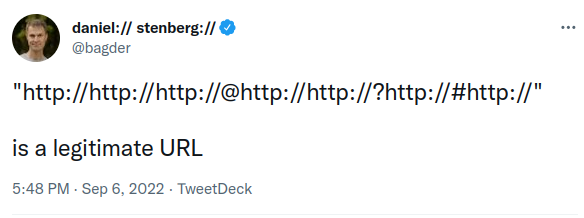

Пару дней назад я опубликовал этот твит:

<figure class="border">

</figure>

Учитывая то, насколько много я получил комментов и ответов, я решил разобрать это подробнее. Правда ли это валидный URL? Во что он парсится? _Что вообще такое URL?_

<!-- more -->

### `curl`

Начнем с `curl`. Он разбирает эту строку, как и должен — как валидный URL. Чтобы было понятнее, я раскрасил его составные части:

<figure class="border">

</figure>

**Черная** часть `http` — схема URL, указывает на протокол HTTP. Строка `://` разделяет схему и _authority part_ (все, что до пути).

**Красная** часть `http` — имя пользователя; за ним следует `:` (двоеточие)

**Зеленая** часть `//http://` — пароль; отделен знаком `@`.

**Синяя** часть `http:` — имя хоста, включая двоеточие на конце. После этого двоеточия должен идти номер порта, но если его нет, то `curl` подставляет порт по умолчанию; браузеры поступают аналогично. Порт по умолчанию для HTTP имеет номер `80`.

**Сиреневая** часть `//http://` — путь. В пути вполне могут встретиться и несколько слешей подряд, и двоеточие. После пути стоит `?` (знак вопроса).

**Оранжевая** часть `http://` — query. Все, что между `?` и `#`.

**Бирюзовая** часть `http://` — fragment, он же anchor, он же якорь, как его только не называют. Все, что справа от `#`.

Можете сами попробовать запросить этот URL с помощью `curl`:

```sh
curl "http://http://http://@http://http://?http://#http://" --resolve http:80:127.0.0.1
```

### Парсер URL в `curl`

Парсеру URL в `curl` уже пара десятков лет. Один из основных принципов его доработки — **не ломать существующие скрипты и приложения**. Поэтому даже если его поведение где-то расходится со стандартами, оно, вероятно, останется таким навсегда.

В самом начале разработки, парсер в `curl` проглатывал очень много вольностей в URL. С годами он становился все более строгим, но следы изначального поведения еще видны тут и там. Кроме того, мы были вынуждены дорабатывать парсер, чтобы он разбирал URL из реального мира, даже если они не соответствуют никаким стандартам. Если что-то работает в браузерах и других приложениях, это должно работать и в `curl`.

### Стандарты URL

Как я уже писал ранее, у понятия URL [на самом деле нет четкого определения].

[на самом деле нет четкого определения]: https://daniel.haxx.se/blog/2016/05/11/my-url-isnt-your-url/

Есть определение UR**I** — не UR**L**! — в [RFC 3986]. Есть [спецификация WHATWG], которой следуют браузеры (или пытаются). А еще есть множество конкретных реализаций разной степени строгости, которые совершенно не обязательно следуют хоть какому-то из этих двух определений.

[rfc 3986]: https://datatracker.ietf.org/doc/html/rfc3986
[спецификация whatwg]: https://url.spec.whatwg.org/

Если приглядеться повнимательней, то вряд ли хоть какие-то две реализации будут полностью соответствовать друг другу.

Поэтому если попытаться использовать наш безумный URL где-то в реальном мире, нельзя сказать точно, примут его или нет. Твиттер, к примеру, не понял, что это URL. И даже если он окажется валидным для них, они, скорее всего, распарсят его по-другому.

### Python и `urllib`

[April King] протестировала наш безумный URL в питоновской `urllib`. И хотя он и разобрался успешно, но совершенно по-другому:

[april king]: https://twitter.com/CubicleApril/status/1567191200813178891

```py
ParseResult(scheme='http',
            netloc='http:',
            path='//http://@http://http://',
            params='',
            query='http://',
            fragment='http://')
```

Судя по ответам на мой твит, такой интерпретации придерживаются еще несколько парсеров. Вполне возможно, у них на самом деле один и тот же парсер под капотом.

### JavaScript

[Meduz] показал мне, как этот URL разбирает JavaScript, и это оказалось очень похоже на наш результат с Python:

[meduz]: https://twitter.com/meduzen/status/1567177588669300736

<figure class="border">

</figure>

### Firefox и Chrome

Я дописал `127.0.0.1 http` в `/etc/hosts`, и скопипастил наш безумный URL в адресную строку Firefox. Браузер переписал его вот так:

```
http://http//http://@http://http://?http://#http://
```

Второе слева двоеточие съелось, все остальное осталось как прежде. Но, тем не менее, Firefox воспринял это как валидный URL, и открыл страницу с моего локального сервера.

Chrome повел себя точно так же.

### RFC 3986

В комментах кто-то заметил, что слэши в authority, не закодированные urlencode, не соответствуют RFC 3986. Секция 3.2 этого документа гласит:

> The authority component is preceded by a double slash ("//") and is terminated by the next slash ("/"), question mark ("?"), or number sign ("#") character, or by the end of the URI.\

Это значит, что в нашем пароле `//http://` слеши в начале и конце должны быть заменены на `%2f`. То есть, получается, URL не валидный?

**Update (от автора):** похоже, что он все еще считается валидным, просто должен быть разобран иначе, чем это делает `curl`.

### HTTPS

Этот URL может быть переписан с использованием HTTPS:

```
https://https://https://@https://https://?https://#https://
```

Но я не использовал эту форму по нескольким причинам:

- Это на семь символов длиннее.
- Это сложнее протестировать локально, без возни с сертификатами.
